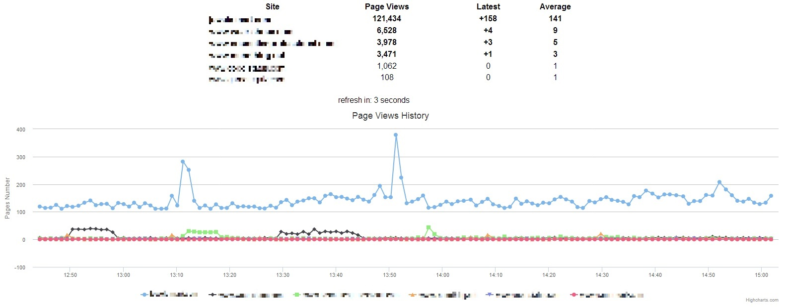

# Page Views by Iliyan Trifonov
[](https://gitter.im/iliyan-trifonov/page-views?utm_source=badge&utm_medium=badge&utm_campaign=pr-badge&utm_content=badge)

[](https://styleci.io/repos/19856803)

### Quickly check your sites, visitors and search engines behaviour without slowing down your server or staying late at night!

## What is it?
This script stores and shows the page views for the day on a single or multiple domains.
It shows the page views made since the beginning of the current day at 00:00h(server time), the 
page views in the last minute, an average views per minute and also a chart as a history since the page was loaded.
No difference between visitors is made. It's just your site and how many pages are opened.
Enough to make conclusions or just check if the site is working.

## Tech stuff
This script uses PHP and [Memcached](http://memcached.org/)/[Redis](http://redis.io/) to store the number of page views 
on the current domain. 
It is using the `HTTP_HOST` variable as a key and increases the page views value.

Memcached CAS() and Redis' HINCRBY are used for atomicity. Memcached takes the whole array of values, updates it and
puts it back on the server while Redis is working directly with the specified domain's value with one call.

For security you can provide the domain name to the tracking script or the default `$_SERVER['HTTP_HOST']` will be used.
No personal information is taken from the visitor at all, it's just your domain keeping how many times 
its pages are opened.

The [Admin Dashboard](templates/index.phtml) is built with [AngularJS](public/js/) and [CSS3](public/css/) 
animations. Thanks to AngularJS things like automatic new domain inserting and ordering by page views is done very easy 
and without forcing you to refresh. Thanks to Memcached/Redis there is no overhead for your sites.

There is an AngularJS service called [Api](public/js/services.js) which can be extended to return more and different 
information if you implement it in the [backend](modules/PageViewsAdmin.php) too.

## Adapters
Since version 1.3.0 there are special objects called Adapters which are sitting between the Page Views code
and the different servers that store the values.

There are 2 adapters by default now: [MemcachedAdapter](modules/adapters/MemcachedAdapter.php) 
and [RedisAdapter](modules/adapters/RedisAdapter.php).

In `config.php` there are settings for the 2 adapters and one `"default" => "memcached"` to set the server to be used.
Just change the configuration to `"default" => "redis"` to use a Redis server. Don't forget to change the configuration
specific for your environment too(host, port, etc.).

The connect timeout for the Redis adapter is set to a very low value to avoid slow pages if your Redis server dies 
for some reason. The connection to the Memcached server behaves the same.

The Adapters make is possible to create a new one for different server(e.g. MongoDB, File, etc.).
If you are going to use a different server, create an Adapter by following the contract given by the `AdapterInterface`:

```php
interface AdapterInterface
{
    public function setServer($server);
    public function setConfig($config);
    public function init();
    public function get();
    public function incr($domain);
}
```

The Adapters extend a [BaseAdapter](modules/adapters/BaseAdapter.php) which provides 3 of the functions needed by the
interface: setServer(), setConfig() and get().

In your new Adapter you will need to implement init() and incr() functions but when your server has a special call 
for get() you will have to override it too(like the Redis Adapter).

The BaseAdapter provides one additional function: setDate() which is needed only by the cron if you use it.

The get() function is expected by PageViews to return an array like:

```php
["domain1.com" => 123, "www.domain2.com" => 345]
```

Pay a special attention on that **the numbers of the page views must be integers**. Use (int)$pageviews when building 
this result. Check the Redis adapter for more info.

Implement these functions and put your new file in `adapters/MyAdapter.php`. 
Name the adapter file the same as the class name inside it.

The autoloader will look for the `.php` files in `modules/` and `modules/adapters/`.

Register your adapter in `AdapterFactory::$adapters` and add new configuration in `config/config.php`.
Then set the `"default" => "mynewservername"` and you are ready!

## How to use it?
You edit the [config/config.php](config/config.php) file, probably just changing the `default` and `host`/`port` values 
if the server is not running on the local host.
Then include [track.php](track.php) in your own site's `index.php` and that's all about the tracking.

Until the tracking is running you setup a new webserver configuration to point to PageViews' [public dir](public) 
and use [index.php](public/index.php)  as the default page. An example [Nginx](http://nginx.org/) configuration follows:

    server {
            server_name pageviews.your-server.com;

            root /home/mydir/www/pageviews/public;
            index index.php;

            #it's better if you protect this page
            auth_basic "Restricted";
            auth_basic_user_file  /home/mydir/.htpasswd_pageviews;

            location ~ \.php$ {
                    fastcgi_pass 127.0.0.1:9000;
                    fastcgi_index index.php;
                    fastcgi_param  SCRIPT_FILENAME $document_root$fastcgi_script_name;
                    include fastcgi_params;
            }
    }

Reload the web server's configuration and go to http(s)://pageviews.your-server.com where the `public/index.php` file
will be loaded and you will be presented with a similar page:



There is a sample cron file in [crons/cron.php](crons/cron.php) that can be used to send you the page views of all 
domains for the previous day by email.
It can be ran at or after 00:00h on the next day to get the full results of the previuos day.
You can change the example call to the mail() function with PHPMailer or a special email/sms service.

## More info

The main Memcached/Redis key is connected to the current day and cached for 24h so when your server passes 00:00h
a new key will be used keeping the old one for a day to be used later if needed. The old keys usualy expire after 24h.

The page refreshes its contents every 60 seconds (configurable in [app.js](public/js/app.js)) by using Angular's $http 
call and receives a JSON array. It calculates the difference between the old and new values, an average and stores a 
historical data using the amazing [Highcharts.js](http://www.highcharts.com/).

If you refresh the page all of the data will be lost except the one that shows how many page views happenned today.
This and other little things may be changed in future updates.
